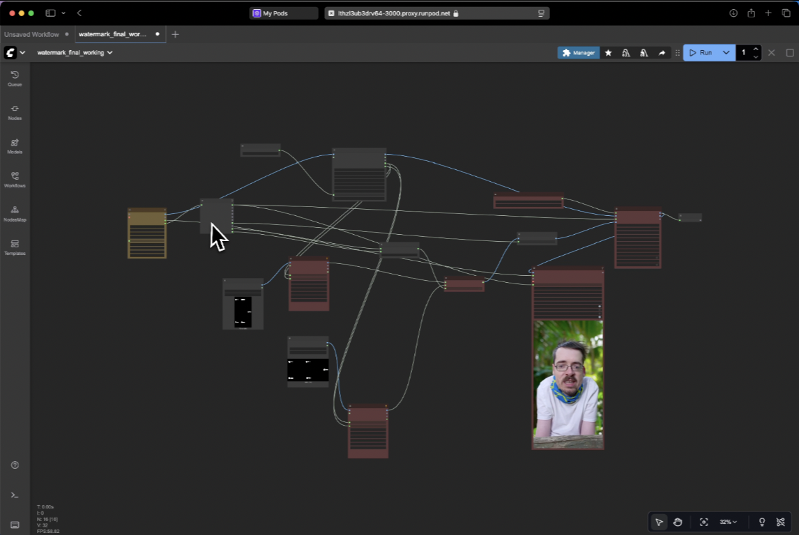

# Hanzo Painter

AI-powered content-aware inpainting for videos and images. Intelligently remove and reconstruct content using ComfyUI, DiffuEraser, and SAM2.

Part of the [Hanzo AI](https://hanzo.ai) ecosystem.



## Features

- 🎨 **Content-Aware Inpainting** - AI reconstructs removed areas intelligently
- 🪄 **Smart Removal** - Remove watermarks, objects, blemishes, or any unwanted elements
- 🧠 **Context Understanding** - Analyzes surroundings to generate realistic fill content
- 🤖 **SAM2 Integration** - Click-to-segment any object with precision (optional)
- 🎬 **Temporal Consistency** - Smooth, flicker-free video output across frames
- 🔊 **Audio Preservation** - Maintains original audio track
- ⚡ **GPU-Accelerated** - Fast processing with CUDA support
- 🍎 **MLX Support** - Native Apple Silicon acceleration (70% faster model loading, 35% faster inference)

## Quick Start

```bash
# Complete setup
make all

# Or step by step
make setup              # Install ComfyUI + nodes
make download-models    # Download SAM2 models
make install-workflow   # Copy workflow to ComfyUI
make run               # Start server on localhost:8188
```

## Manual Installation

### Prerequisites

- Python 3.8+
- CUDA-compatible GPU (8GB+ VRAM recommended) OR Apple Silicon Mac (M1/M2/M3/M4 with MLX)
- Git, wget

```bash
# Using Make (recommended)
make setup              # Install ComfyUI and all custom nodes
make install-sam2       # (Optional) Install SAM2 for advanced segmentation
make install-mlx        # (Optional) Install MLX for Apple Silicon acceleration
make download-models    # Download SAM2 models
make install-workflow   # Copy workflow to ComfyUI

# Manual installation
git clone https://github.com/comfyanonymous/ComfyUI.git
cd ComfyUI && pip install -r requirements.txt
```

### Required Models

Place these in `ComfyUI/models/`:

1. **checkpoints/realisticVisionV51_v51VAE.safetensors**
2. **diffusers/pcm_sd15_smallcfg_2step_converted.safetensors**
3. **sam2/** (auto-downloaded via `make download-models`)

### Custom Nodes (Auto-installed)

- ComfyUI_DiffuEraser
- ComfyUI-VideoHelperSuite
- ComfyUI-Easy-Use
- ComfyUI-KJNodes
- ComfyUI_LayerStyle
- ComfyUI-SAM2 (optional - advanced segmentation)
- ComfyUI-MLX (optional - Apple Silicon acceleration)

## Usage

```bash
# Start server
make run                # Standard mode
make run-mlx            # MLX acceleration (Apple Silicon only)
make run-lowvram        # Low VRAM mode
make run-cpu            # CPU-only mode

# Access at http://localhost:8188
# Load workflow: workflows/inpainting-workflow.json
```

### Processing Workflow

1. Place video in `ComfyUI/input/`
2. Open http://localhost:8188
3. Load `inpainting-workflow.json`
4. Update video filename in `VHS_LoadVideo` node
5. Configure parameters (see below)
6. Click "Queue Prompt"
7. Output appears in `ComfyUI/output/`

## Configuration

### Key Parameters

| Parameter | Default | Description |
|-----------|---------|-------------|
| num_inference_steps | 15 | Denoising steps |
| guidance_scale | 10 | Removal strength |
| video_length | 50 | Processing chunk size |
| frame_load_cap | 300 | Max frames to load |
| frame_rate | 8 | Output FPS |

### Performance Tuning

**Out of memory?**
- Reduce `video_length` or `subvideo_length`
- Use `make run-lowvram`
- Decrease `frame_load_cap`

**Too slow?**
- Increase `ref_stride`
- Reduce `neighbor_length`
- Lower `num_inference_steps`

**Poor quality?**
- Increase `guidance_scale`
- Add more `num_inference_steps`
- Enable SAM2 for better masks

## Makefile Commands

```bash
make help               # Show all commands
make setup              # Complete setup
make all                # Setup + workflow + models
make run                # Start ComfyUI server
make update             # Update ComfyUI and nodes
make test               # Test installation
make clean              # Remove caches
make info               # Show installation info
make models-info        # Show downloaded models
```

## Architecture

```
Input Video → Load & Process → DiffuEraser → SAM2 (optional) → Output Video
                                    ↓
                            Watermark Removal
                                    ↓
                            Temporal Smoothing
```

## Troubleshooting

| Issue | Solution |
|-------|----------|
| CUDA out of memory | Use `make run-lowvram` or reduce batch size |
| Models not found | Check paths in `ComfyUI/models/` |
| Slow processing | Reduce video length or use GPU |
| Poor results | Increase guidance_scale or use SAM2 |

## Development

```bash
make clean              # Clean caches
make update             # Update all components
make uninstall          # Remove ComfyUI
```

## License

Educational and research purposes only.

## How It Works

1. **Mask Selection** - Use SAM2 to click/segment objects or create manual masks
2. **Context Analysis** - AI analyzes surrounding pixels and video frames
3. **Intelligent Reconstruction** - Diffusion model generates realistic fill content
4. **Temporal Blending** - Ensures smooth consistency across frames
5. **Output** - Clean video with removed content seamlessly inpainted

**Note**: This is true inpainting, not just erasing. The AI intelligently reconstructs what should be there based on context.

## About

Hanzo Painter is part of the [Hanzo AI](https://hanzo.ai) ecosystem, providing AI infrastructure and services for developers.

- **hanzo.ai** - Core AI infrastructure platform
- **hanzo.io** - Business solutions
- **hanzo.network** - Decentralized compute marketplace

---

Made with ❤️ by [Hanzo AI](https://hanzo.ai)
