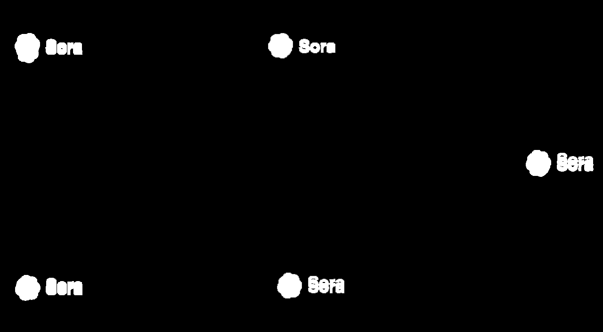
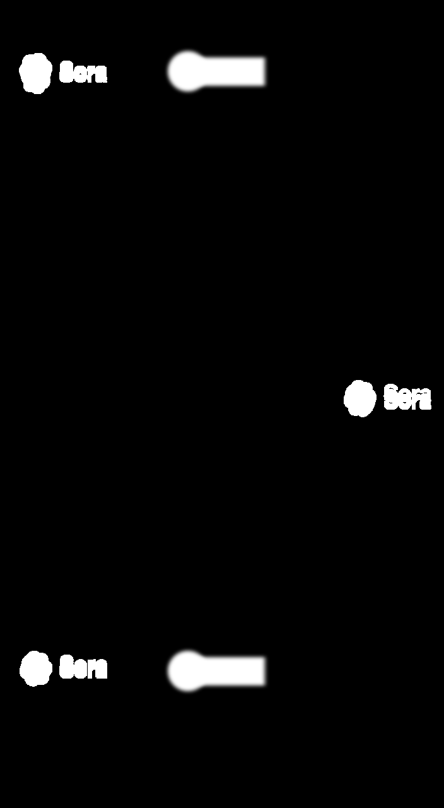

# Content Aware Inpainting V2 - ComfyUI Workflow

A powerful ComfyUI workflow for removing watermarks from videos using DiffuEraser technology. This workflow can be used for removing any type of watermark from video content while maintaining video quality and temporal consistency.


*ComfyUI workflow interface showing the complete watermark removal pipeline*

## 🎯 Features

- **Universal Watermark Removal**: Works with any type of watermark (stock footage, user-generated content, AI-generated videos, etc.)
- **Advanced Segmentation**: Optional SAM 2 integration for precise watermark detection and mask creation
- **Temporal Consistency**: Maintains smooth video flow across frames
- **Multiple Input Support**: Handles both video files and static images
- **Smart Resizing**: Automatically scales content while preserving aspect ratios
- **Batch Processing**: Can process multiple frames efficiently
- **Audio Preservation**: Maintains original audio track in output videos
- **Flexible Masking**: Choose between automatic detection or manual SAM 2 segmentation
- **Adaptable Workflow**: Easy to modify for different watermark types and video sources

## 🛠️ Models Used

### Primary Models
- **DiffuEraser Model**: `pcm_sd15_smallcfg_2step_converted.safetensors`
- **Base Model**: `realisticVisionV51_v51VAE.safetensors`
- **Segmentation Model**: `briaai/RMBG-2.0` (for background removal)

### Advanced Segmentation (Optional)
- **SAM 2 (Segment Anything Model 2)**: For precise watermark detection and mask creation
  - **Model**: `sam2_hiera_large.pt` or `sam2_hiera_base_plus.pt`
  - **Purpose**: Advanced object segmentation for complex watermark shapes
  - **Benefits**: More accurate mask generation for irregular watermarks

### Required Custom Nodes
- **ComfyUI_DiffuEraser**: Core watermark removal functionality
- **ComfyUI-VideoHelperSuite**: Video processing and manipulation
- **ComfyUI-Easy-Use**: Utility nodes for workflow control
- **ComfyUI-KJNodes**: Image resizing and processing utilities
- **ComfyUI-LayerStyle**: Advanced image scaling capabilities
- **ComfyUI-SAM2** (Optional): SAM 2 integration for advanced segmentation

## 📋 Prerequisites

- ComfyUI installed and running
- Python 3.8+ 
- CUDA-compatible GPU (recommended)
- Sufficient VRAM (8GB+ recommended for video processing)

## 🚀 Installation

### Method 1: RunPod Setup

1. **Create RunPod Instance**:
   - Choose a GPU instance (RTX 4090 or A100 recommended)
   - Select Ubuntu 20.04 or 22.04
   - Ensure at least 24GB VRAM for optimal performance

2. **Install ComfyUI**:
   ```bash
   git clone https://github.com/comfyanonymous/ComfyUI.git
   cd ComfyUI
   pip install -r requirements.txt
   ```

3. **Install Required Custom Nodes**:
   ```bash
   # Navigate to ComfyUI custom_nodes directory
   cd custom_nodes
   
   # Install DiffuEraser
   git clone https://github.com/ComfyUI/ComfyUI_DiffuEraser.git
   
   # Install VideoHelperSuite
   git clone https://github.com/Kosinkadink/ComfyUI-VideoHelperSuite.git
   
   # Install Easy-Use nodes
   git clone https://github.com/yolain/ComfyUI-Easy-Use.git
   
   # Install KJNodes
   git clone https://github.com/kijai/Comfyui-KJNodes.git
   
   # Install LayerStyle
   git clone https://github.com/chflame163/ComfyUI_LayerStyle.git
   
   # Install SAM2 (Optional - for advanced segmentation)
   git clone https://github.com/cubiq/ComfyUI-SAM2.git
   ```

4. **Download Required Models**:
   ```bash
   # Create models directory structure
   mkdir -p models/diffusers
   mkdir -p models/checkpoints
   mkdir -p models/vae
   
   # Download DiffuEraser model
   wget -O models/diffusers/pcm_sd15_smallcfg_2step_converted.safetensors [MODEL_URL]
   
   # Download base model
   wget -O models/checkpoints/realisticVisionV51_v51VAE.safetensors [MODEL_URL]
   
   # Download SAM2 models (Optional)
   mkdir -p models/sam2
   wget -O models/sam2/sam2_hiera_large.pt https://dl.fbaipublicfiles.com/segment_anything_2/072824/sam2_hiera_large.pt
   wget -O models/sam2/sam2_hiera_base_plus.pt https://dl.fbaipublicfiles.com/segment_anything_2/072824/sam2_hiera_base_plus.pt
   ```

5. **Start ComfyUI**:
   ```bash
   cd ComfyUI
   python main.py --listen 0.0.0.0 --port 8188
   ```

### Method 2: Local Installation

1. **Clone ComfyUI**:
   ```bash
   git clone https://github.com/comfyanonymous/ComfyUI.git
   cd ComfyUI
   pip install -r requirements.txt
   ```

2. **Install Custom Nodes** (same as RunPod method)

3. **Download Models** (same as RunPod method)

4. **Run ComfyUI**:
   ```bash
   python main.py
   ```

## 📖 Usage Instructions

### Basic Usage

1. **Load the Workflow**:
   - Open ComfyUI in your browser
   - Load the `inpainting-workflow.json` workflow file

2. **Input Your Video**:
   - Place your video file in the `ComfyUI/input` directory
   - Update the video filename in the `VHS_LoadVideo` node

3. **Configure Settings**:
   - **Video Length**: Set to desired number of frames (default: 300)
   - **Frame Rate**: Adjust based on your video (default: 8 FPS)
   - **Seed**: Use a fixed seed for reproducible results
   - **Guidance Scale**: Higher values for stronger watermark removal (default: 10)

4. **Run the Workflow**:
   - Click "Queue Prompt" to start processing
   - Monitor progress in the ComfyUI interface

### Advanced Configuration

#### DiffuEraser Settings
- **num_inference_steps**: Number of denoising steps (default: 15)
- **guidance_scale**: Strength of watermark removal (default: 10)
- **mask_dilation_iter**: Mask expansion iterations (default: 4)
- **ref_stride**: Reference frame stride (default: 10)
- **neighbor_length**: Neighbor frame length (default: 10)
- **subvideo_length**: Sub-video processing length (default: 50)

#### SAM 2 Integration (Optional)
- **Model Selection**: Choose between `sam2_hiera_large.pt` (more accurate) or `sam2_hiera_base_plus.pt` (faster)
- **Point Prompts**: Click on watermark areas to guide segmentation
- **Box Prompts**: Draw bounding boxes around watermarks for better detection
- **Mask Refinement**: Use SAM 2's iterative refinement for complex watermarks
- **Multi-Object Detection**: Segment multiple watermarks simultaneously

#### Video Processing Settings
- **frame_load_cap**: Maximum frames to process (default: 300)
- **custom_width/height**: Force specific dimensions
- **format**: Output format (AnimateDiff recommended)

## ⚙️ Workflow Components

### Input Processing
- **VHS_LoadVideo**: Loads and processes input video
- **VHS_VideoInfo**: Extracts video metadata (FPS, dimensions, etc.)
- **LoadImage**: Loads static images for comparison

### Image Processing
- **LayerUtility: ImageScaleByAspectRatio V2**: Smart image scaling
- **ImageResizeKJv2**: Precise image resizing
- **easy ifElse**: Conditional processing logic

### Watermark Removal
- **DiffuEraserLoader**: Loads the watermark removal model
- **DiffuEraserSampler**: Core watermark removal processing
- **SAM2 Nodes** (Optional): Advanced segmentation for precise mask creation
  - **SAM2Loader**: Loads SAM 2 model
  - **SAM2Predictor**: Generates segmentation masks
  - **SAM2MaskProcessor**: Refines and processes masks

### Output Generation
- **RepeatImageBatch**: Handles batch processing
- **VHS_VideoCombine**: Combines processed frames into final video
- **easy cleanGpuUsed**: Memory cleanup

## 🔧 Troubleshooting

### Common Issues

1. **Out of Memory Errors**:
   - Reduce `video_length` parameter
   - Lower `subvideo_length` value
   - Use a GPU with more VRAM
   - Disable SAM 2 if using basic segmentation

2. **Slow Processing**:
   - Increase `ref_stride` value
   - Reduce `neighbor_length`
   - Use fewer inference steps
   - Use SAM 2 base model instead of large model

3. **Poor Quality Results**:
   - Increase `guidance_scale`
   - Add more inference steps
   - Adjust `mask_dilation_iter`
   - Use SAM 2 for better mask accuracy

4. **SAM 2 Issues**:
   - Ensure SAM 2 models are properly downloaded
   - Check GPU memory when using large SAM 2 model
   - Verify point/box prompts are correctly placed

### Performance Optimization

- **GPU Memory**: Use `--lowvram` flag if running out of memory
- **CPU Processing**: Use `--cpu` flag for CPU-only processing (slower)
- **Batch Size**: Adjust based on available VRAM

## 📁 File Structure

```
ComfyUI/
├── input/                          # Place your videos here
│   └── your_video.mp4
├── output/                         # Processed videos appear here
│   └── AnimateDiff_00001-audio.mp4
├── models/
│   ├── diffusers/                  # DiffuEraser models
│   ├── checkpoints/                # Base models
│   ├── vae/                        # VAE models
│   └── sam2/                       # SAM 2 models (optional)
└── custom_nodes/                   # Installed custom nodes
```

## 🎛️ Node Configuration

### Key Parameters

| Node | Parameter | Default | Description |
|------|-----------|---------|-------------|
| DiffuEraserSampler | num_inference_steps | 15 | Denoising steps |
| DiffuEraserSampler | guidance_scale | 10 | Removal strength |
| DiffuEraserSampler | video_length | 50 | Processing length |
| VHS_LoadVideo | frame_load_cap | 300 | Max frames to process |
| VHS_VideoCombine | frame_rate | 8 | Output frame rate |
| SAM2Predictor | model_type | large | SAM 2 model size |
| SAM2Predictor | points_per_side | 32 | Segmentation density |

## 📝 Notes

- **Processing Time**: Depends on video length and GPU power
- **Quality**: Higher settings = better quality but slower processing
- **Memory Usage**: Monitor VRAM usage during processing
- **Output Format**: Videos are saved in MP4 format with H.264 encoding
- **Universal Application**: This workflow works with any video source
- **Customization**: Easily adapt parameters for different watermark types and video qualities

## 🤝 Contributing

Feel free to submit issues and enhancement requests!

## 📄 License

This workflow is provided as-is for educational and research purposes.

## 🎭 Watermark Masks

These are examples of masks that can be used with the workflow to remove various watermark orientations and types:

### Horizontal Watermark

*Example of horizontal watermark mask that can be used with this workflow*

### Vertical Watermark

*Example of vertical watermark mask that can be used with this workflow*

---

**Happy watermark removing! 🎬✨**
